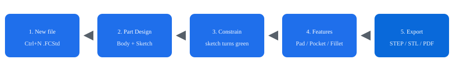

# FreeCAD 使用教程

面向零基础用户的 **FreeCAD 1.1** 中文入门教程。按章节跟练，大约 1～2 小时可以完成第一个参数化零件，并导出给 3D 打印或工程协作使用。

当前稳定版：**1.1.3**（以 [官网下载页](https://www.freecad.org/downloads.php) 为准）。1.1.x 修复了若干可通过恶意 `.FCStd` 触发的安全问题，建议不要打开来源不明的文件，并尽量升级到最新维护版本。

## 你将学会

- 安装 FreeCAD，并把界面切到简体中文
- 看懂工作台、模型树、草图约束
- 用 **零件设计 + 草图** 做出一个 L 形安装支架
- 导出 STEP / STL，以及出一张简单工程图
- 用 Python 脚本生成几何（适合做参数扫描或重复建模）；示例见 [`examples/plate_with_hole.py`](examples/plate_with_hole.py)

## 学习路径

| 章节 | 内容 | 建议 |
|------|------|------|
| [01 安装与中文界面](docs/01-install.md) | Windows / macOS / Linux 安装、语言、单位、导航 | 先做完再建模 |
| [02 界面与工作台](docs/02-interface.md) | 窗口分区、鼠标操作、常用工作台 | 10 分钟 |
| [03 草图与约束](docs/03-sketcher.md) | 画线、尺寸、完全约束 | 核心概念 |
| [04 第一个零件：L 形支架](docs/04-first-part.md) | 填充、开槽、圆角、倒角 | **必做练习** |
| [05 其他常用工作台](docs/05-workbenches.md) | 零件、工程图、装配、电子表格 | 按需阅读 |
| [06 导出、打印与协作](docs/06-export.md) | STEP / STL / 网格质量 | 做完零件再看 |
| [07 Python 脚本入门](docs/07-python.md) | 控制台、宏、参数化盒子 | 研究/自动化 |
| [08 速查表与排错](docs/08-cheatsheet.md) | 快捷键、常见报错、官方资源 | 随手查 |

## 推荐工作流（记住这一条）

1. 切到 **零件设计** 工作台
2. 在平面上 **创建草图**
3. 画闭合轮廓，加约束，直到求解器显示 **完全约束**（几何变绿）
4. **填充** 成实体，再在面上继续草图 → **开槽 / 孔 / 圆角**
5. 改尺寸时只改草图或特征参数，模型会自动更新

不要一上来就用零件工作台做布尔“堆方块”，那会丢掉参数历史，后面改尺寸会很痛苦。

## 官方入口

- 下载：<https://www.freecad.org/downloads.php>
- 文档：<https://wiki.freecad.org/>
- 中文入门：<https://wiki.freecad.org/Getting_started/zh>
- 论坛：<https://forum.freecad.org/>

本教程按 1.1 界面编写；1.0 的菜单名称大体相同，个别工具（装配仿真、草图投影等）仅 1.1 提供。
