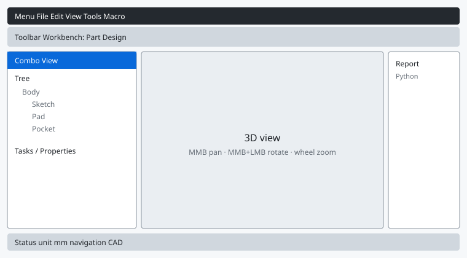

# 02 界面与工作台

FreeCAD 不是“一个工具栏包打天下”，而是按任务切换 **工作台（Workbench）**。场景里的模型不会丢，变的是你手头那一套工具。

## 窗口分区

| 区域 | 作用 |
|------|------|
| 工作台下拉框 | 在窗口顶部工具栏，切换零件设计 / 草图 / 工程图等 |
| 组合视图 | 左侧。上半是 **模型树**，下半是 **任务面板** 或 **属性** |
| 3D 视图 | 中间。建模、选面、旋转查看 |
| 报告视图 | 底部或可停靠。报错、布尔失败、约束冲突会写在这里 |
| Python 控制台 | **视图 → 面板 → Python 控制台**。可直接跑脚本 |

建模时养成习惯：**先看模型树，再看 3D**。选不中对象时，几乎都是点错了树节点，或当前有别的 Body 处于激活状态。

## 模型树里最重要的三个词

- **文档**：一个 `.FCStd` 文件。
- **主体（Body）**：零件设计的容器。一个 Body 里是一条特征历史：草图 → 填充 → 开槽 → 圆角……
- **激活**：树里 Body 名称加粗 / 高亮，表示后续草图和特征会加到它里面。右键主体 → **切换激活**。

一个零件一个 Body。多个零件再考虑 **Std Part** 容器或 **装配** 工作台。

## 选择与可见性

- 左键点选；**Ctrl** 加选；在树上点名称最稳。
- 树上对象前的空格键：**显示 / 隐藏**。草图被填充挡住时，选中草图按空格即可再编辑。
- 右键 → **外观** 可改颜色和透明度，不影响几何。

选不中被挡住的边时，用 1.1 的 **澄清选择（Clarify Selection）**，或把视图切到线框：`V` 然后 `3`（线框）/ `V` 然后 `2`（实体）。

## 常用内建工作台

| 工作台 | 中文名 | 什么时候用 |
|--------|--------|------------|
| Part Design | 零件设计 | **单个实体零件**（本教程主线） |
| Sketcher | 草图 | 画 2D 轮廓；零件设计里会自动切过来 |
| Part | 零件 | 基本体 + 布尔并/差/交，适合快速概念或无历史几何 |
| TechDraw | 工程图 | 从 3D 出 2D 图纸、尺寸、PDF |
| Assembly | 装配 | 1.0 起内置，约束多个零件的相对位置 |
| Spreadsheet | 电子表格 | 用单元格驱动草图尺寸（参数表） |
| Draft | 制图 | 2D 线、建筑平面、与 BIM 配合 |
| BIM | 建筑 | 墙、窗、楼层（原 Arch） |
| FEM | 有限元 | 网格、材料、求解（需额外求解器） |
| CAM | 数控 | 刀路（1.1 有新的刀具库） |
| Mesh | 网格 | STL 修复、不是参数建模主战场 |

新手路线：**零件设计 + 草图** 就够做出绝大多数可打印、可机加的零件。工程图、装配放到第五章。

## 文档习惯

1. **文件 → 新建**（`Ctrl+N`）
2. 立刻 **保存**，文件名用英文或拼音，避免个别插件对中文路径不友好。
3. 切到 **零件设计**。
4. 需要时 **视图 → 面板** 打开报告视图，布尔或填充失败时先读红字。

## 坐标系

FreeCAD 使用右手系。零件设计默认三个基准面：

- **XY**：顶视，最常用的底板平面
- **XZ**：前视
- **YZ**：右视

草图一定要贴在某个面或基准面上。贴错平面是“拉伸方向完全反了”的第一原因。

下一章：[03 草图与约束](03-sketcher.md)
