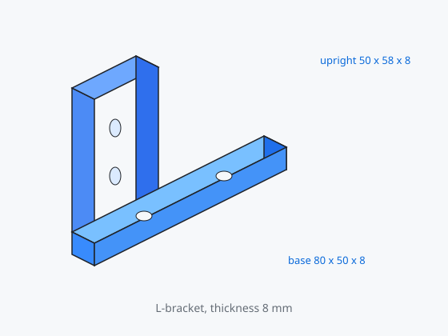
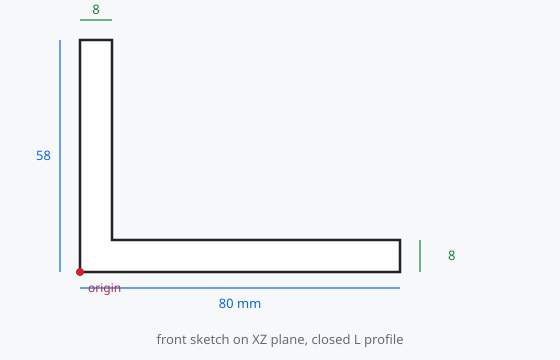
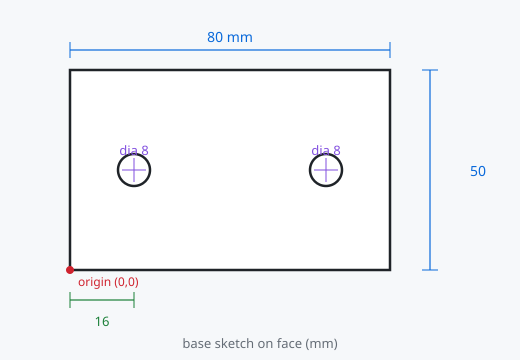

# 04 第一个零件：L 形安装支架

做一个可机加、可 3D 打印的直角支架。主线只用到零件设计里最常用的四类特征：**填充、开槽、圆角、倒角**。

做法是：在前视平面画一个 **闭合的 L 形**，一次填充成实体，再在面上打孔。这样始终是一个主体，不会出现“立板和底板对不齐”的问题。

## 成品尺寸（毫米）

| 部位 | 尺寸 |
|------|------|
| 底板 | 80 × 50 × 8 |
| 立板 | 厚 8、高 50（从底板顶面算起；轮廓总高 58） |
| 宽度 | 填充深度 50（即支架宽度） |
| 底板安装孔 | 2 × 直径 8，距两端 16，沿宽度方向居中 |
| 立板安装孔 | 2 × 直径 8，竖直间距 24，距立板顶边 13，水平居中 |
| 内转角 | 圆角 R6 |
| 外棱 | 倒角 1 × 45°（可选） |

## 0. 准备工作

1. **文件 → 新建**，立刻保存为 `L-bracket.FCStd`。
2. 切换到 **零件设计** 工作台。
3. 确认单位是毫米。

## 1. 在 XZ 平面画 L 形轮廓

1. **创建草图** → 选择 **XZ_Plane**（前视）→ 确定。
2. 用 **折线**（或两段矩形再修剪）画出闭合 L：
   - 立板在左侧，厚度 8，从 y=0 到 y=58
   - 底板沿 x 到 80，厚度 8（y=0 到 y=8）
   - 所有端点必须重合，最后回到起点
3. 把左下角点与 **原点重合**。
4. 加上尺寸（不要重复标注）：
   - 底板长度 **80**
   - 底板厚度 **8**
   - 立板厚度 **8**（可用 **相等** 约束让两处壁厚相同，只标一次 8）
   - 轮廓总高 **58**（= 立板 50 + 底板 8）
5. 外轮廓必须是 **一个闭合环**，中间不要有孤岛。
6. 求解器显示 **完全约束**（绿色）后点 **关闭**。

若填充以后才发现开口：回到草图，用 **校验草图**，把没粘住的端点加 **重合**。

## 2. 填充成 50 mm 宽

1. 模型树选中 `Sketch`。
2. **填充（Pad）** → 类型 **尺寸** → 长度 **50 mm**。
3. 预览应是一块 L 形实体。1.1 可拖拽半透明预览上的箭头改宽度。
4. 确定。树里出现 `Pad`。

此时还没有孔。先保证 L 的形状和壁厚正确，再打孔，后面改尺寸更稳。

## 3. 底板两个通孔

1. 在 3D 视图点选 **底板顶面**（80 × 50 的那一面）。
2. **创建草图**（附着在该面上）。
3. 画两个圆，**相等** 约束，再标一个 **直径 8 mm**。
4. 两圆心关于板宽中线对称（或到两边距离都是 25）；到两端短边距离各 **16 mm**。

   

5. 完全约束后关闭。
6. **开槽（Pocket）** → 类型选 **贯通（Through all）** → 确定。

孔没有打穿时：确认开槽选的是贯通，且圆是完整闭合圆而不是 270° 圆弧。

## 4. 立板两个通孔

1. 点选立板 **外表面**（大约 50 × 58 的大面）。贯通开槽会打穿壁厚。
2. 创建草图，两个直径 8 的圆，相等约束只标一次直径。
3. 水平居中；上圆距顶边 **13 mm**；两圆心竖直距离 **24 mm**。
4. 关闭 → **开槽** → **贯通**。

## 5. 内转角圆角

1. 点选底板顶面与立板内侧面相交的那条 **内边**（L 的腋下）。
2. **圆角（Fillet）**，半径 **6 mm**。
3. 1.1 可在预览里拖半径。确定。

半径大于 8 mm 壁厚时容易失败。先 6 mm，确认成功再加大。

## 6. 外棱倒角（可选）

1. **Ctrl** 加选底板和立板的外轮廓边。
2. **倒角（Chamfer）**，尺寸 **1 mm**。
3. 孔口若要倒角，再单独选圆边做一次 0.5 mm，装配螺丝会更容易。

## 7. 检查与改尺寸

树的顺序应类似：

`Sketch` → `Pad` → `Sketch001` → `Pocket` → `Sketch002` → `Pocket001` → `Fillet` → `Chamfer`

- 双击第一个草图，把 80 改成 100，关闭后底板变长；若孔距标的是“到短边 16”，孔会跟着短边走。
- 选中 `Pad`，属性里改 Length，支架宽度变化；贯通开槽仍会打穿。
- **不要**用“变换 / 移动”去掰已经成型的实体。参数化的正确改法是改草图和特征数值。

## 8. 常见失败对照

| 现象 | 处理 |
|------|------|
| 填充报未闭合 | 草图端点没重合；校验草图并修剪线头 |
| 填充方向反了或厚度为负 | 对话框勾选 **反向** |
| 孔是盲的 | 开槽选 **贯通**；圆必须闭合 |
| 圆角 / 倒角变红 | 半径过大，或前序特征改完边拓扑变了，重新选边 |
| 草图过约束 | 两个圆用 **相等 + 一个直径**，不要各标一个直径又加相等 |
| 选不中面 | 切到线框 `V` `3`，或用 1.1 的澄清选择 |

## 做完之后

- 导出 STEP / STL：见 [06 导出、打印与协作](06-export.md)。
- 出工程图、装配、用表格驱动尺寸：见 [05 其他常用工作台](05-workbenches.md)。

下一章：[05 其他常用工作台](05-workbenches.md)
